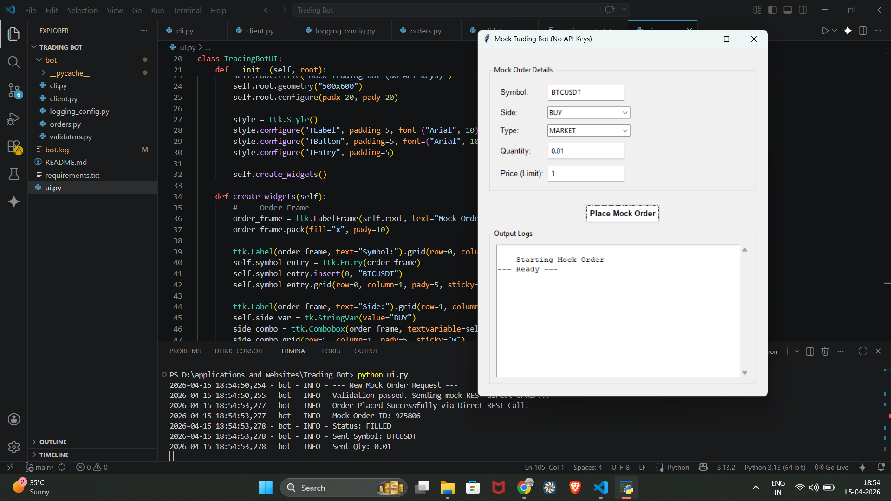
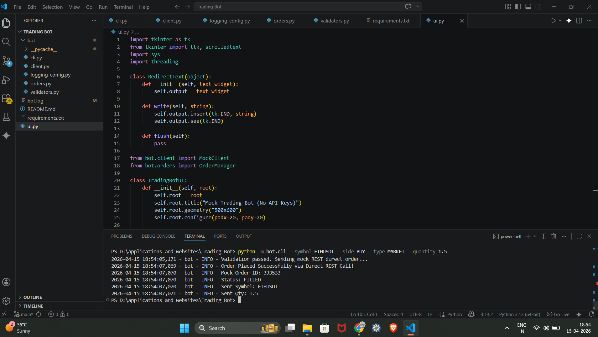

# Mock Trading Bot (No APIs)

A simple, risk-free training tool that lets you practice placing cryptocurrency trades (like buying Bitcoin or selling Ethereum) without using real money or connecting to a real exchange. 

Instead of talking to a real trading platform like Binance, it sends practice signals to a safe test server (`httpbin.org`). This means you don't need any accounts, passwords, or secret API keys—just run the app and see how a trading bot works safely behind the scenes!

## Prerequisites

You need Python installed on your computer. 

### 1. Install Dependencies
Open your Command Prompt or PowerShell, navigate to this folder, and run:
```bash
pip install -r requirements.txt
```
*(This installs `requests`, which handles the REST calls)*

---

## How to Execute the Code 

You have two ways to run the application: the **Graphical User Interface (UI)** or the **Command Line Interface (CLI)**.

### Option 1: Run the Visual UI (Easiest)
Simply run this command in your terminal:
```bash
python ui.py
```
A desktop window will open where you can input a Symbol, Side, Type, and Quantity. Clicking "Place Mock Order" will send a real REST request to `httpbin.org` and display the parsed response in the logs window.



### Option 2: Run via Command Line (CLI)
If you prefer running commands directly in the terminal, you can use the CLI tool. 

**Example of a Market Order:**
```bash
python -m bot.cli --symbol ETHUSDT --side BUY --type MARKET --quantity 1.5
```

**Example of a Limit Order:**
```bash
python -m bot.cli --symbol BTCUSDT --side SELL --type LIMIT --quantity 0.5 --price 60000
```

The script will validate your inputs, send the direct REST request, and print the resulting success message to the console.



---

## What it does under the hood

1. **`bot/client.py`**: Initiates a `requests.Session()` and posts the payload as a JSON REST call to `httpbin.org`.
2. **`bot/orders.py`**: Intercepts the response from the mock server, generates a simulated order ID, and treats it as a success if validation passes.
3. **`bot/validators.py`**: Checks that user inputs are logically sound before any network call is ever made.

If your file names are slightly different (e.g., `gui.png` instead of `GUI.png`), make sure to adjust the text inside the parentheses in the `README.md` to match the exact filename, as markdown image links are case-sensitive.
